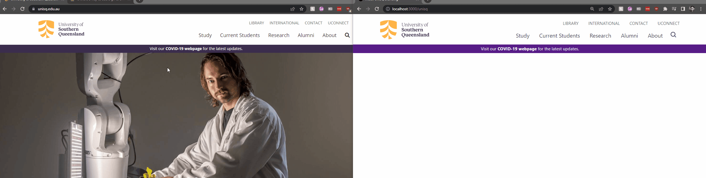

# 100DaysOfCode

Hey there! I've decided to commence the 100 days of code challenge in order to elevate my development skills and hopefuly work on some apps with fellow developers.
Although I've spent a lot of time in backend land - the same cannot be said for front-end development, and so at least for my first mini-project I'll be trying to recreate the UniSQ homepage using Tailwind CSS built on NextJS.

I'll be sharing progress as I go as well as lessons learnt and generally how I'm feeling (I'm assuming this will be less exciting around day 35) so if you'd like to follow that journey then please don't hesitate to watch the code-base - otherwise feedback on how I may improve is also always welcome!

I intend to post to Dev.to as well, but one step at a time...

Day 1:
- Using the Tailwind installation documentation I managed to get a project built and running which was a great first step if I've ever heard one.
- Biggest lesson from today outside of just Tailwind in general, is read the docs! I ended up implementing a needlessly complicated React useState solution (because this is what I was comfortable with) to handle button-hover events since I wasn't sure how to implement this using the utility based approach of Tailwind (ended up deciding `className={ function() ? isn't hovered : is hovered }` and this was a huge waste of time when all I had to do was use the `hover:<<Tailwind Utility>>` syntax to get what I needed done! I'll be posting about how such biases can overcomplicate our codebases in a future dev.to article

Tabs I had Open:<br>
https://tailwindcss.com/docs/configuration || https://tailwindcomponents.com/cheatsheet || https://react-icons.github.io/react-icons/search?q=search || https://www.unisq.edu.au/

<br>
Day 2:

Goal: Finish the nav pop-up sections which appear on hover of respective nav elements

Implementation:
I want to emphasise that I have no interest in writing mountains of html for this project - nor any projects hereafter. as such I created a JSON data container in the shape of the following:

```json
{
    ...
    Alumni: {
        Links: [
            [
                "Alumni benefits",
                "Contribute to UniSQ"
            ],
            [
                "Alumnus of the Year Awards",
                "Career services"
            ],
            [
                "Alumni community"
            ]
        ], 
        Prompt: "Connect with UniSQ and your fellow alumni", 
        ButtonText: "Update your details"
    },
    ...
}
```

If I was making this fully featured then this arrays would be filled with objects of `{DisplayText: "", Link: ""}` instead of plain strings - but for the sake of recreating the home page I think this is plenty for the time being!

Regarding this evening's favourite chunk (granted there aren't many to account for post-first round of refactoring) would be the following:

```jsx
{
    navDropDownData[hoveredNav].Links.map((column) => { return (
        <ul>
            { column.map((row) => { return ( <li className='py-2 px-4 hover:bg-gray-200 mx-2'> {row} </li> ); })}
        </ul>
    )});
}
```

Result: <br>
I think the below gif speaks for itself! the broad strokes are most definitely there

<br>



Tabs I had Open:<br>
https://tailwindcomponents.com/cheatsheet || https://www.unisq.edu.au/
