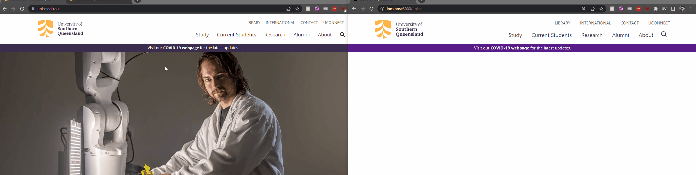

# 100DaysOfCode

はじめまして、マグリジ・トリスタンです。
開発者力を発展したり開発者同士と共に協力したりするように今日から百日までに毎日一時間ぐらいはプログラミングすることになりました。

バックエンド開発の体験と違ってフロントエンド開発の体験はあまり持ってなくて最初のミニプロジェクトのは、現在働いてる大学のホームページがTailwind CSSとNextJSでやり直したいです。

順調つつ習った事や、やる気状態や、進歩もよく報告します。<br>
なぜかというと35日になると楽しみが増えちゃうような気がします。<br>
宜しければ解いてる新たな冒険がフォローして頂いて幸せなのです。<br>
それもまた、フィードバックがあれば是非遠慮せずに教えていただけませんか？<br>
成長するために皆の知識が受け取りたくて評論を歓迎します。<br>

それで　Dev.to　というウェブサイトにもブログを書く予定です

一番目の日:

- Tailwindのインストール文書化に従って新たなTailwind付けNextJSプロジェクトが作りました。それだけで素晴らしい第一歩だと思います <br>

- 一応Tailwindの実用的なクラスを基づいたCSS遣い以外に、今日の大教えは　「文書化を読め！」という感じです。読めずに要らないReactのuseStateでボタンを触ってるとCSSを変わる機能が作りましたが、第一Tailwindの文書化を読んだとすればTailwindの`hover:`書き方で7線の代わりに一線で出来るようになりました。

<br>

# 例えば
最初のReactで：

```jsx

const buttons = {
    Study: "Study", 
    "Current Students": "Current Students",
    Research: "Research",
    Alumni: "Alumni", 
    About: "About",
    None: "None"
};

const [ buttonHovered, setButtonHovered ] = useState(buttons.None);

const handleButtonOnMouseEnter = (button) => { setButtonHovered(button) }
const handleButtonOnMouseLeave = () => { setButtonHovered(buttons.None) }
...
<ul className='flex justify-between ml-auto'>
    {
        ["Study", "Current Students", "Research", "Alumni", "About"].map((e, indx) => {
        return (
            <li key={indx} 
                className = { 
                    buttonHovered == buttons.Study
                    ? 'text-lg text-gray-700 pb-4 px-4'
                    : 'text-lg text-gray-700 pb-4 px-4 border-b-yellow-500 border-b-4 pb-0 cursor-pointer';
                }
            > {e} </li>
        )});
    }
    <BiSearch className='text-xl translate-y-1'/>
</ul>
```

書き直し：
```jsx
<ul className='flex justify-between ml-auto'>
    {
        ["Study", "Current Students", "Research", "Alumni", "About"].map((e, indx) => {
        return (
            <li key={indx} 
                className={'text-lg text-gray-700 pb-4 px-4 hover:border-b-yellow-500 hover:border-b-4 hover:pb-0 hover:cursor-pointer'}
            > {e} </li>
        )})
    }
    <BiSearch className='text-xl translate-y-1'/>
</ul>
```

プログラミング中のタブ:<br>
Tailwindのインストール文書化：https://tailwindcss.com/docs/configuration<br>
Tailwindのチートシート：https://tailwindcomponents.com/cheatsheet/<br>
Reactのアイコン：https://react-icons.github.io/react-icons/search?q=search<br>
本来のウェブサイト：https://www.unisq.edu.au/

二番目の日:

目的: ナブメニューの下の所が書き切る

実現:
説明する先に一つ明らかに言いたいことがあります。<br>
言いたいことはHTMLを書くのはあまり好きではなくて一生懸命コードで自動的に起こしたいけど、こういうHTML造りはTailwindとReactに沿ってることから、心配しないでください！

じゃ、それでHTMLを書くの代わりにJavaScriptオブジェクトの中にナブサブメニューのデータ置いてスクリプトで残せるようになります！<br>
そのオブジェクトは、こうみたいです。

```json
{
    "Alumni": {
        "Links": [
            [
                "Alumni benefits",
                "Contribute to UniSQ"
            ],
            [
                "Alumnus of the Year Awards",
                "Career services"
            ],
            [
                "Alumni community"
            ]
        ], 
        "Prompt": "Connect with UniSQ and your fellow alumni", 
        "ButtonText": "Update your details"
    },
}
```

もちろん、ホームページだけではなかったら文字列だけではなく特別の　`{DisplayText: "", Link: ""}`　みたいなオブジェクトを使うけど、それぐらいあまり必要ではありません。

次のコードブロックでこのオブジェクトが用いれられます！

```jsx
{
    navDropDownData[hoveredNav].Links.map((column) => { return (
        <ul>
            { column.map((row) => { return ( <li className='py-2 px-4 hover:bg-gray-200 mx-2'> {row} </li> ); })}
        </ul>
    )});
}
```

Result: <br>
下の例動画で自分の目で確かめてください！

<br>



Tabs I had Open:<br>
https://tailwindcomponents.com/cheatsheet || https://www.unisq.edu.au/